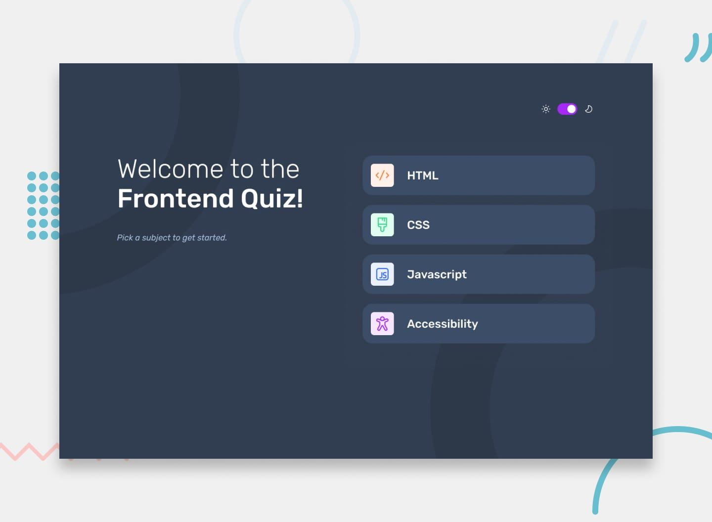

<meta name="google-site-verification" content="OedG6z_yBBZoAiK_HPHH0TFabf0beZEKxIwvZu5dXfg" />

<div align="center">
    
    <h1>Stack Quiz - Test Your Knowledge</h1>
</div>



_This preview shows the main interface of Stack Quiz, featuring a modern design with dark and light themes._

## 📑 Table of Contents

- [Overview](#-overview)
- [Features](#-features)
- [Technologies Used](#-technologies-used)
- [Run Project](#-run-project)
- [Live Demo](#-live-demo)
- [Author](#-author)
- [Attribution](#attribution)

## 💻 Overview

Stack Quiz is an interactive quiz application designed to test and improve your knowledge in various technology-related subjects. Built using modern frontend technologies, this project provides an engaging and responsive experience across all devices.

This is a solution to the [Frontend quiz app challenge on Frontend Mentor](https://www.frontendmentor.io/challenges/frontend-quiz-app-BE7xkzXQnU). Frontend Mentor challenges help you enhance your coding skills by working on real-world projects.

## ✅ Features

Stack Quiz offers a variety of features to enhance user engagement and accessibility:

- 📝 Select a quiz subject.
- 🎯 Choose the correct answer from multiple-choice options.
- 🚫 Receive error messages for incomplete submissions.
- ✔ Get instant feedback on your answers.
- 👉 Navigate seamlessly to the next question.
- 🎉 View your final score upon quiz completion.
- 🔁 Restart the quiz to select another topic.
- 📱 Enjoy a fully responsive design across all devices.
- 👀 Experience smooth hover and focus states.
- 🎮 Use the app entirely via keyboard navigation.
- 🌙 Toggle between light and dark themes.

## 🛠 Technologies Used

- **Framework**: Next.js (Canary)
- **ORM**: Prisma
- **Database**: PostgreSQL
- **Styling**: Tailwind CSS
- **State Management**: Context API
- **Deployment**: Vercel

## 🌐 Live Demo

Check out the live version of the app here: [Stack Quiz Demo](https://stack-quiz.vercel.app)

## 👉 Run Project

### Prerequisites

Ensure you have the following installed on your system:

- Node.js (LTS version recommended)
- pnpm

#### Setup and Run

1. Clone the Repository

   ```bash
   $ git clone https://github.com/KassiaMabily/stack-quiz
   $ cd stack-quiz
   ```

2. Environment Variables

   ```bash
   $ cp .env.example .env
   ```

3. Install Dependencies

   ```bash
   $ pnpm install
   ```

4. Run the App
   ```bash
   $ pnpm dev
   ```

## 👥 Author

<div align="center">
  <small>Kassia Fraga - Dezembro/2024</small>

[](https://www.instagram.com/kassia.mabily/)
[](https://www.linkedin.com/in/kassia-fraga/)

</div>

## Attribution

- [Frontend Mentor](https://www.frontendmentor.io/challenges)
- [Icons made by meaicon](https://www.flaticon.com/authors/meaicon)
